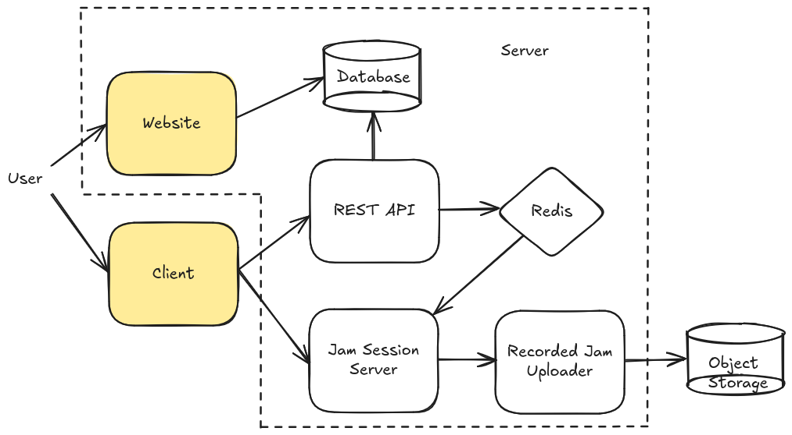

This documentation covers how to run and develop jammr.

Overview
--------
The jammr **website** is the landing page where prospective users find out
about jamming together online. Users sign up for an **account** on the website
and there is a **forum** for user discussion and technical support.

The jammr **client** is a Windows/macOS/Linux application for jamming together
online. The client is available for download on the website. The client
connects to the website’s **REST API** for login, listing jams, and creating
private jams.

Behind the REST API there is server-side software that monitors the number of
jam sessions and starts new ones as needed for public or private jams. When jam
sessions finish or periodically when enough time has passed, recorded jam
processing mixes down audio tracks from the jams and uploads them to object
storage. The recorded jams are listed on the website and email notifications
are sent to users so they can listen or download.

Here is a simplified picture of the architecture:

